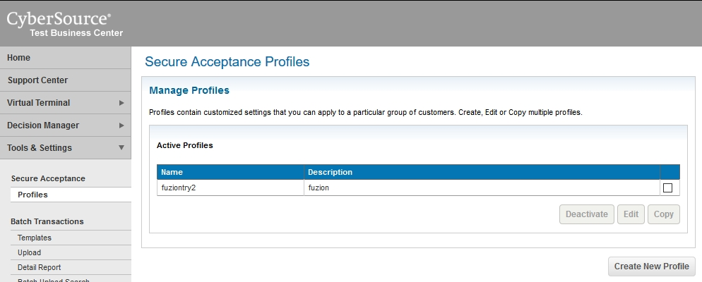
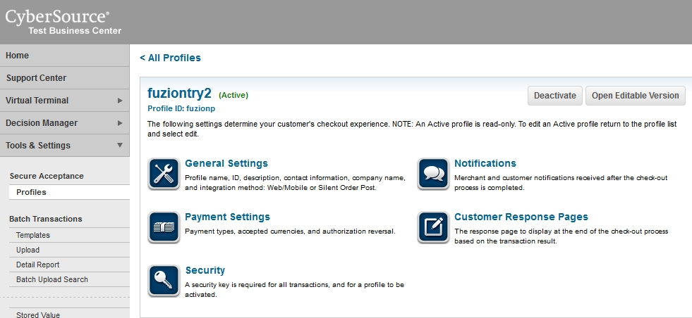
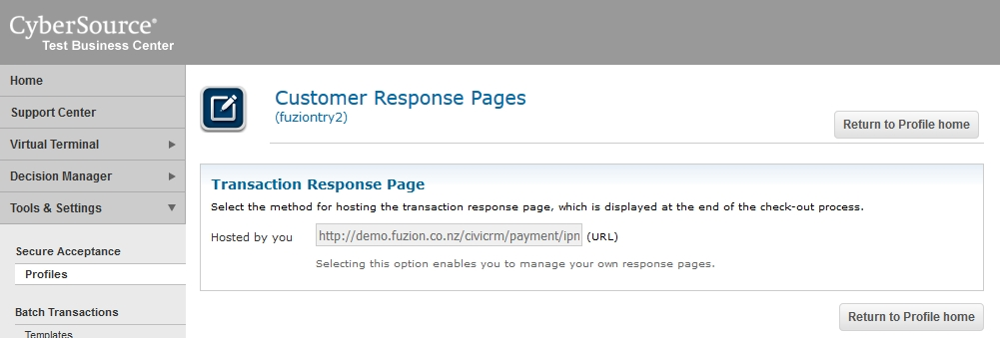
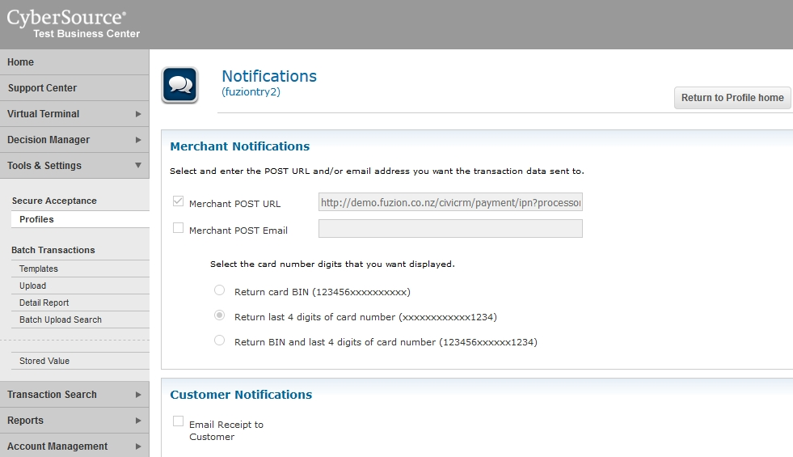

When setting up Cybersource you need to create a profile.

Within the profile you will need to configure the return urls to be
https://yoursite/civicrm/payment/ipn/xx where x is the id
of the processor you have configured.

