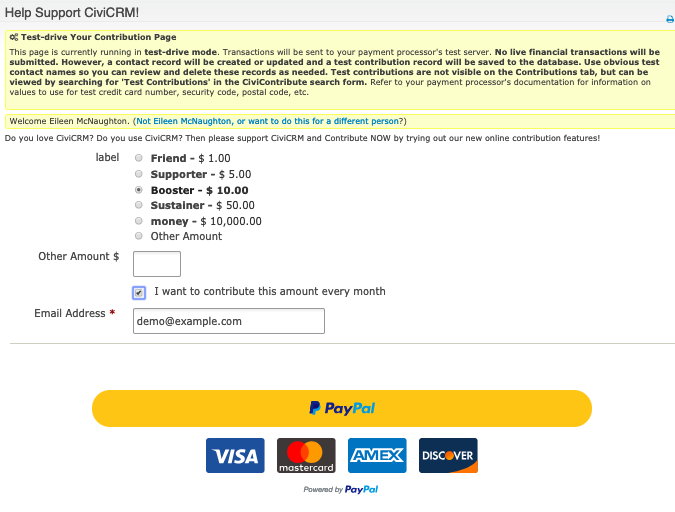
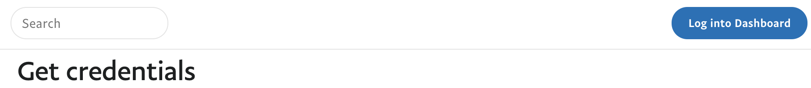
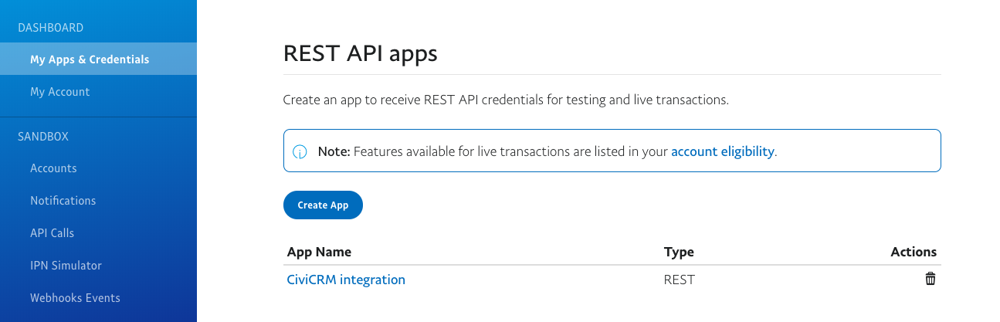
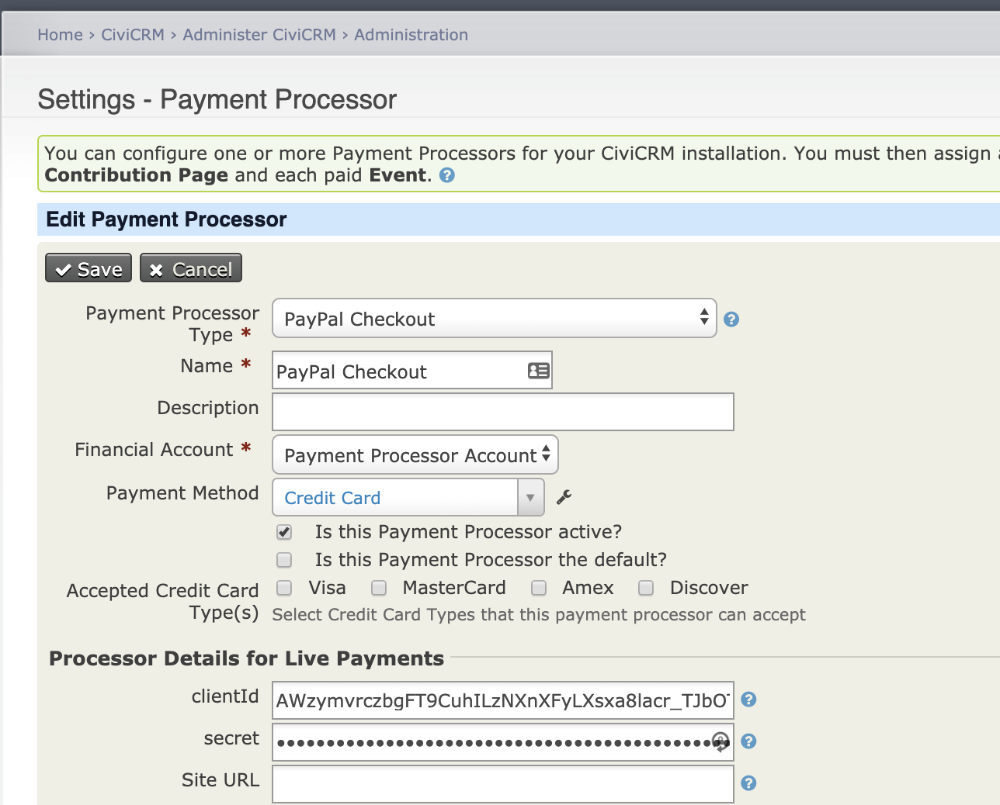

The Paypal Checkout integration adds Paypal buttons to your page which launch an authorization popup



## Advantages of Paypal checkout

1) No PCI exposure - users can pay by credit card but the credit card is
never entered on a form anywhere directly on your site
1) For US mobile users Venmo is automatically available
1) If the user's credit card expires or is otherwise cancelled and recurring payments
are set up it's likely no intervention is required. With traditional payment processing
gateways a new authorization process would be required but with Paypal it's likely the
user would themselves update their paypal credit card and there would be no follow up needed.
(This is particularly the case when the user pays more than one organization with paypal or
frequently uses it)

## Venmo
Venmo should appear automatically if the [prerequisites are met](https://help.venmo.com/hc/en-us/articles/115010455987-Getting-Started-Purchasing-with-Venmo).


In short, the following prerequisites should be met before Venmo button is visible:

    Venmo is available only in production
    Using live account
    Both buyer and seller should be in US
    Available on Mobile
    In order to see the Venmo button, the buyer has to have the Venmo app and the Venmo cookie dropped on their browser.

## Getting started
To get started you need CiviCRM 5.13+, the Omnipay extension (you can install this from 'Add Extensions' on your extensions page), a clientId and a secret key. For information on how to set these up go to   https://developer.paypal.com/docs/api/overview/#get-credentials.

Note that when it says log into dashboard there is actually a link at the top right hand corner which is what it refers to.


You will be directed to [create an app](https://developer.paypal.com/webapps/developer/applications/myapps).
The screen is per below.
You can give the app any name - the name doesn't matter

 

Once you have the credentials (client ID + secret key) you can add a payment processor through the normal CiviCRM interface
(*Administer->CiviContribute->Payment Processors*).

Enter the credentials into this screen:



## Setting up recurring
To use recurring contributions with CiviCRM and Paypal Checkout you need to enable **Reference Transactions** on your Paypal account.

CiviCRM is using **Reference Transactions** to manage the recurring payments. This is effectively a *Card on File* implementation as 
CiviCRM instructs Paypal to take the payments based on your specified frequency (eg. Monthly).

### Enabling Reference Transactions on your Paypal account
* If you have an Account Manager (AM), you should contact your account manager and they should be able to help you.
* Otherwise, for a non-managed account you need to file a ticket through the [Merchant Technical Support Help Center](https://www.paypal-techsupport.com/s/?language=en_US).
  * You should request that Reference Transactions be enabled.

You will usually receive an email requesting lot's of information about your business and charging profile and a warning:
```text
Reference Transactions are one of our riskiest products as it allows
 you to change the amount and frequency of the payments being taken.
As this carries such a high risk it is not something that we offer all merchants.

In line with this, please complete the following information so that we can
 submit an application for Reference Transactions on your behalf. Once the
 information has been submitted, it may take 7 to 10 days to have this approved.

...
```

Once a recurring payment has been paid the payments are processed from your site's scheduled jobs.

You can edit the recurring payment profile and change the date, frequency, 
amount etc through the normal edit recurring payment scheme and these will be 
respected by the scheduled job.


